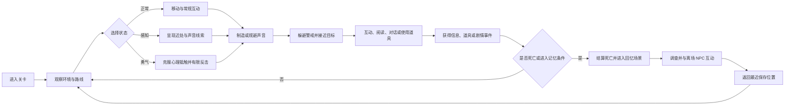
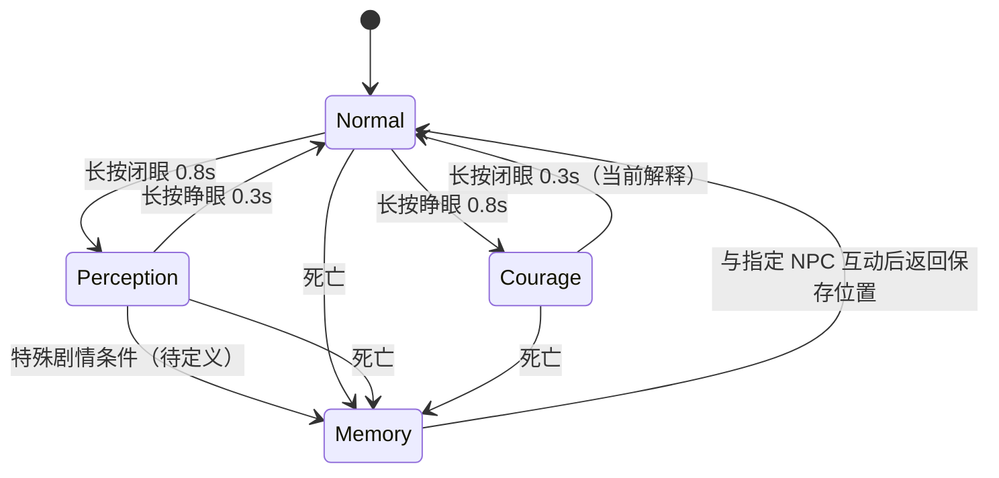

# 《不要忘记阿黛尔》游戏设计摘要

> 状态：内部设计参考稿，基于 2026-08-09 读取的《不要忘记阿黛尔》设计文档及同日后续设计回应整理。
> 来源：`D:/Claude/不要忘记阿黛尔.docx`。原文共 235 个段落，包含完整剧透。
> 标签：`已确定`、`暂定`、`待决策`、`建议`。

## 1. 一句话定位

一款俯视角 3D 单机叙事潜行解谜游戏：玩家以女孩露丝的回忆为入口，在战争、逃难、收养与返乡的经历中，通过“闭眼/睁眼”切换四种心理状态，发现环境线索、躲避敌人、解决知识锁谜题，并逐步确认自己的身份和姐姐的下落。

核心情绪不是战胜敌人，而是在恐惧、记忆和不完整信息中继续前进。

## 2. 体验支柱

1. **状态化观察**：正常、感知、勇气、回忆四种状态改变可见信息、移动方式、交互范围和叙事解释。
2. **弱势潜行**：敌人拥有视野、听觉与警戒阶段，玩家主要依靠路线、掩体、声音管理和时机生存。
3. **知识锁解谜**：部分能力从系统上一直存在，但玩家需要先获得信息、尝试或剧情提示，才能理解其用途。
4. **回忆式叙事**：不同年龄的露丝、片段化记忆、重复意象和最终身份线索共同构成叙事结构。
5. **风格化压抑美术**：水彩感、简化纹理、描边和关卡色调共同服务于“记忆并不可靠”的主题。

## 3. 核心循环

## 4. 四状态机制

状态切换是游戏最重要的公共规则。后续设计回应已确定首版输入与长按节奏；非死亡进入回忆、并发输入和少数禁用场景仍待补充。

本摘要中的时间、距离、速度、角度、冷却和警戒阈值均是首版调优基线，最终权威值应由 UE 编辑器中的配置资产、Input 资产或蓝图默认值提供，而不是写死在规则代码中。

| 状态 | 已确定行为 | 视觉/信息 | 移动与交互 |
|---|---|---|---|
| 正常 Normal | 默认状态，大部分剧情发生在此 | 关卡正常渲染 | 可互动，可潜行、走路、奔跑 |
| 感知 Perception | 正常状态闭眼进入；显示额外线索 | 角色周围 4.5m 持续显示；声音周围 2m 显示 5s；花朵等主线提示更明显 | 默认潜行，不能走路或奔跑 |
| 勇气 Courage | 正常状态再次睁眼进入；克服心理抵触；首个切片只可击退指定敌人，不能击杀 | 正常渲染叠加边缘模糊、过曝和失真 | 可走路、奔跑，不能潜行；攻击 CD 暂定 1s；击退后敌人停止追逐 0.6s |
| 回忆 Memory | 特殊条件或死亡后进入独立场景，储存重要记忆和真结局信息 | 静谧、安详、淡淡悲伤；陈列收集品、书架、花朵和提示 NPC | 默认走路，不能潜行或奔跑 |

### 4.1 输入与状态动画

| 语义 | 键鼠 | Xbox 手柄 |
|---|---|---|
| 移动 | `WASD` | 左摇杆 |
| 默认交互 | `E` | `X` |
| 快捷物品 | `1`-`4` 直接使用对应栏位 | 左/右方向键选择栏位，`Y` 使用 |
| 跑步/走路 | `Shift` 切换 | `A` 切换 |
| 潜行/走路 | `C` 切换 | `B` 切换 |
| 背包/笔记/收藏品 | `Tab` | 上方向键 |
| 暂停 | `Esc` | `Start` |
| 闭眼 | 长按鼠标左键 | 长按 `LT` |
| 睁眼 | 长按鼠标右键 | 长按 `RT` |
| 推进对话 | `Space` 或鼠标左键 | `A` |

- 从正常状态进入感知或勇气时，长按阈值暂定 `0.8s`，完整 UI 动画约 `1s`。不足 `0.8s` 时取消并回退动画；达到阈值即切换成功，动画结束前拒绝下一次状态操作。
- 从感知或勇气返回正常状态时，长按阈值缩短为 `0.3s`，动画约 `0.5s`、按两倍速播放。当前解释是感知通过“睁眼”返回、勇气通过“闭眼”返回，仍需在输入原型中确认。
- 一次按下最多产生一次状态请求。完整动画结束后可立即开始相反操作；双键同时按下、动画锁定时的失败提示和特殊场景禁用规则仍待定义。
- 对话使用独立输入上下文：打字机动画播放时再次确认会立即显示当前句全文；全文显示后再次确认才推进下一句。对话期间鼠标左键不触发闭眼。

### 知识锁

勇气状态可能从游戏开始就可进入，但玩家通常会根据“睁眼后不能再次睁眼”的常识不去尝试。设计目标是让玩家通过剧情或自行实验获得规则认知，而不是用硬性锁阻止探索。提前发现应当有额外解法或少量额外内容作为回报。

## 5. 潜行与警戒

### 5.1 敌人感知

- 视野：敌人前方约 45° 扇形，默认半径 5m；可被墙体等模型阻挡。
- 听觉：角色移动、奔跑和环境声音根据关卡类型吸引不同范围内的敌人。
- 警戒值范围：0 到 11。
- 警戒条：0 隐藏；1-5 白色；6-10 红色；11 满值并带额外红色特效。

| 警戒值 | 敌人行为 | 变化规则 |
|---|---|---|
| 0 | 原地或巡逻 | 吸引注意变为 1；直接发现角色变为 6 |
| 1-5 | 看向异常、东张西望 | 从 0 来时观察 3s；自然下降每 0.5s -1；再次异常 +1 并重置观察 |
| 6-10 | 前往最新异常位置，抵达后搜索 | 移动速度 1.7m/s；途中维持值；吸引注意 +1，最多到 10；发现角色变 11 |
| 11 | 持续追逐 | 追逐速度 3m/s；看不见角色后降为 10；追上角色则死亡 |

### 5.2 掩体

可移动掩体：桌下、草丛、管道。不可移动掩体：柜子、箱子。进入掩体后默认切换潜行模式，且掩体中的角色不可被敌人看到，即使处于敌人视野扇形内。

掩体的退出条件、敌人是否能听到进入/退出、掩体容量和多人 NPC 交互仍待定义。

### 5.3 移动与声音

| 移动模式 | 速度 | 声音 | 关卡影响 |
|---|---:|---|---|
| 潜行 | 0.8m/s | 最小，不产生引起注意的声音 | 感知状态默认使用 |
| 走路 | 1.5m/s | 一般 | 室内 4m；室外潜行 2.5m；室外非潜行只吸引警戒值 >=6 的 2.5m 内敌人 |
| 奔跑 | 2.5m/s | 最大 | 室内立即影响当前房间并使警戒值变 5；室外潜行 6m；室外非潜行 2.5m |

## 6. 交互系统

### 6.1 可交互提示

- 距离 >5m：交互物发射统一粒子提示。
- 2m < 距离 <=5m：添加白色描边。
- 距离 <=2m：显示 `[E]` 与动作说明。
- 多个候选时，选择角色朝向 90° 范围内最近者；同一时间只能交互一个对象。

### 6.2 交互类型

| 类型 | 结果 |
|---|---|
| 拾取 | 可使用道具进入快捷栏；收集品进入收藏品列表并从地图消失 |
| 互动 | 启动机关、开门等，未来可细化为打开、调查等动词 |
| 阅读 | 屏幕中间显示半透明黑底文本，并写入笔记系统 |
| 对话 | 打开角色名、立绘、台词和选项构成的对话系统 |
| 使用 | 检查持有的对应道具；正确则启动机关，错误则震动图标并提示 |

对话和阅读内容预计由 Excel 配表；建议 Excel 只作为创作者输入格式，运行时导入稳定行 ID 的 DataTable 或等价数据资产。

道具交互提供两条等价路径：靠近门或机关后，可直接使用快捷栏中的兼容道具；也可先执行默认交互，再进入背包的“选择使用道具”模式。两条路径必须调用同一套目标筛选、条件检查、消耗与事件结算规则，快捷栏只是操作捷径。

## 7. 物品与信息

- **可使用道具**：钥匙、把手、小刀和勇气状态武器等；提供 4 个快捷栏位。键鼠按 `1`-`4` 直接尝试对应栏位，手柄以左右方向键选择、`Y` 使用。环境道具只能作用于当前交互目标；勇气武器只能在勇气状态下尝试击退符合条件的敌人。
- **笔记**：参考《Resident Evil》文件系统；已阅读文字可重复查看。
- **收集品**：玩偶、打火机等彩蛋或辅助叙事物，不可使用，不占快捷栏，与笔记并列展示。

## 8. 存档

原文设计 11 个槽位：1 个自动存档槽和 10 个玩家槽。后续设计回应将自动存档收敛为**地图切换**和**标记为重要的剧情事件**；普通物体/NPC 互动不再默认写盘。手动存档在非剧情动画期间可用，不能写入自动槽，覆盖已有手动槽。

保存内容包括：地图、位置与朝向、道具、笔记和收集品数量、剧情事件、死亡次数、累计游玩时间和现实时间戳。继续游戏读取时间最新的存档。

### 8.1 死亡与回忆存档流程

1. 触发死亡后立即锁定玩家输入，死亡次数 `+1`，播放不显示 `Game Over` 文本的遮罩动画。
2. 遮罩内切换到回忆场景；场景切换完成后自动存档。该存档写入新的死亡次数和进度，但**不覆盖上次可恢复位置**，避免读档直接出生在回忆场景。
3. 玩家在回忆场景调查并触发事件；与指定 NPC 互动后离场。
4. 播放离场 UI 动画，切回上次保存的地图与位置；世界恢复完成后再次自动存档，以保存回忆场景内获得的事件进度。

因此存档必须区分“持续进度”和“可恢复位置”：死亡次数、回忆调查事件可以在回忆场景更新，恢复地图、位置和朝向保持为死亡前最近一次有效保存点。两次关键自动存档必须顺序执行，不能被普通防抖合并掉。

**建议**：自动存档使用版本号、异步写盘、重要事件标签和 5-10s 普通防抖；死亡进入/离开回忆属于必须顺序完成的关键存档事务。回忆场景能否手动存档，以及程序在回忆中异常退出后的精确恢复提示，仍需确认。

## 9. 叙事摘要

### 9.1 角色

- **露丝 Ruth**：主角，现实年龄约 40-50 岁；主要以 6-9 岁小女孩的形象出现，间插青年、成年和现实形象。露丝是养父母为她取的名字。
- **多萝西 Dorothy**：姐姐，比露丝大 4 岁。把露丝藏上船后离开寻找母亲，与露丝失散。
- **阿黛尔 Adelle**：名字和身份均未定。可能是露丝的本名，也可能是故乡的重要人物或玩偶。
- **养父母**：在关键回忆中告知露丝身世；情绪冲击会使记忆中的形象变得可怕。
- **敌国士兵**：现实中的搜查者，也是露丝成年后幻觉和臆想中的持续敌人。

### 9.2 章节流程

1. **家**：姐姐敲门带露丝离开，听到争吵后把她藏进箱子，并以捉迷藏安慰她。
2. **轮船**：露丝在船上醒来，寻找姐姐和父母，语言不通并躲避船上工作人员；一名会说她语言的女子帮助她。
3. **港口**：女子带她出关并准备调查身份；露丝看见姐姐幻影后独自离开，在港口失踪。
4. **居所和市集**：港口夫妇收养露丝；她在市集帮忙。得知身世后离家，并因“所有人都在议论她”的幻觉潜行离开。
5. **农场**：露丝获得相对安宁的生活，却反复看见士兵和姐姐，最终决定回到故乡。
6. **故乡**：战争结束，露丝发现官方记录显示自己四岁时已死亡，并来到“自己”的墓地。线索足够则与姐姐相遇，否则故事结束。

### 9.3 叙事方向

故事参考《被遗忘的花园》的多线家族秘密结构，但计划使用虚构国家，避免现实国家和战争敏感议题。后续可能加入“阿黛尔不存在”“身份误认”等叙事诡计，以及现实魔幻或灵魂元素。

## 10. 美术与界面

- 正常状态：关卡拥有独立色调，例如“家”偏灰紫，“市集”偏温暖橙黄。
- 风格目标：水彩感、简化纹理、模型描边，参考 `Cairn` 与 `Blue Prince` 的风格化表现。
- 感知状态：近处与声源逐步显形，有声波涟漪；色调保持神秘但不追求纯恐怖压迫。
- 勇气状态：在正常渲染上叠加边缘模糊、过曝和失真。
- 回忆状态：独立安静场景，陈列收集品、书架、NPC 和花朵。
- UI：主菜单、暂停、设置、存档选择、HUD、对话、背包、笔记和收藏品。暂不设计地图界面。
- 对话文字使用打字机入场动画；确认键在动画中用于显示全文，在全文显示后用于推进。

## 11. 术语表

| 术语 | 含义 |
|---|---|
| 感知状态 | 通过闭眼显现近处与声音线索的状态 |
| 勇气状态 | 克服心理抵触并获得有限反击能力的状态 |
| 回忆状态 | 独立记忆场景，承载提示和真结局信息 |
| 知识锁 | 玩家知道规则后才会意识到的解法，而非单纯不可用的硬锁 |
| 警戒值 | 敌人从平静到追逐的 0-11 整数状态 |
| 掩体 | 使敌人无法看见角色的可移动或不可移动藏身处 |

## 12. 待决策清单

- 阿黛尔究竟是露丝本名、重要人物还是玩偶。
- 非死亡情况下感知 -> 回忆的触发条件；回忆场景是否允许手动存档。
- 双眼输入同时按下、动画锁定时的反馈，以及掩体、剧情动画、背包等特殊场景的状态切换权限。
- 勇气攻击的资源成本、有效敌人标签、目标选择范围和敌人反制；首个切片已暂定非致死击退与 `1s` CD。
- 警戒搜索结束、跨房间传播和多敌人联动规则。
- 关卡是否允许自由探索，以及死亡回到保存点时哪些动态敌人与可交互物需要重置。
- “重要剧情事件”的标签清单、自动存档是否记录动态敌人状态，以及真结局线索的最低数量。
- 快捷使用在多个兼容目标、错误道具、消耗品和满背包情况下的反馈与优先级。
- 首个可玩版本的关卡数量、目标时长和内容评级。

## 更新记录

| 日期 | 变更 |
|---|---|
| 2026-08-09 | 纳入输入映射、状态长按、死亡回忆、勇气攻击、自动存档和双路径物品使用的后续设计回应。 |
| 2026-08-09 | 首次从设计文档整理；未修改原始 DOCX。 |
